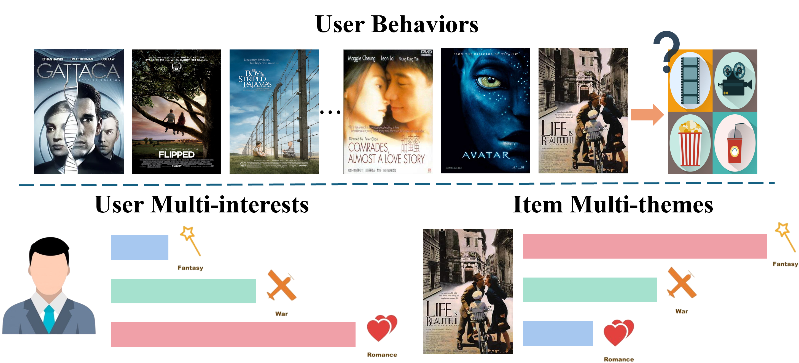

# Multi-Interest-Recommendation-A-Survey

<div align="center">

</div>

<div align="center">
    <a href="https://awesome.re"></a>
    <a href="http://makeapullrequest.com"></a>
    <a href="http://makeapullrequest.com"></a>
</div>

📚 Based on the survey paper "[Multi-Interest Recommendation: A Survey]()", this repository contains a curated list of papers on **multi-interest recommendation** published in top venues. We hope to provide a more comprehensive literature base for the multi-interest recommendation research and the industrial community.

*Continuously updating!*

🤗 Welcome to update this repository by launching an issue or a pull request if you find any missing resources or want to include some new papers.

- [Multi-Interest-Recommendation](#multi-interest-recommendation-a-survey)
  - [Representative Works](#representative-works)
  - [Taxonomy](#taxonomy)
  - [Research Papers Sorted by Published Year](#research-papers-sorted-by-published-year)
    - [Year 2025](#year-2025-back-to-top)
    - [Year 2024](#year-2024-back-to-top)
    - [Year 2023](#year-2023-back-to-top)
    - [Year 2022](#year-2022-back-to-top)
    - [Year 2021](#year-2021-back-to-top)
    - [Year 2020 \& Before](#year-2020--before-back-to-top)
  - [Citation](#citation)
-----

## Representative Works

- (MIND 2019) **Multi-interest network with dynamic routing for recommendation at Tmall** [[Paper]](https://dl.acm.org/doi/abs/10.1145/3357384.3357814) [](https://scholar.google.com/scholar?cites=1927469798043210081&as_sdt=2005&sciodt=0,5&hl=en-EN)
- (DMIN 2020) **Deep Multi-Interest Network for Click-through Rate Prediction** [[Paper]](https://dl.acm.org/doi/abs/10.1145/3340531.3412092) [](https://scholar.google.com/scholar?cites=11955465070065295505&as_sdt=2005&sciodt=0,5&hl=en-EN)
- (ComiRec 2020) **Controllable Multi-Interest Framework for Recommendation** [[Paper]](https://dl.acm.org/doi/abs/10.1145/3394486.3403344) [](https://scholar.google.com/scholar?cites=8119337510944134065&as_sdt=2005&sciodt=0,5&hl=en-EN)
- (SINE 2021) **Sparse-Interest Network for Sequential Recommendation** [[Paper]](https://dl.acm.org/doi/abs/10.1145/3437963.3441811) [](https://scholar.google.com/scholar?cites=14061988584498080015&as_sdt=2005&sciodt=0,5&hl=en-EN)
- (PIMI 2021) **Exploring Periodicity and Interactivity in Multi-Interest Framework for Sequential Recommendation** [[Paper]](https://arxiv.org/abs/2106.04415) [](https://scholar.google.com/scholar?cites=14878467485829787374&as_sdt=2005&sciodt=0,5&hl=en-EN)
- (MINER 2022) **MINER: Multi-Interest Matching Network for News Recommendation** [[Paper]](https://aclanthology.org/2022.findings-acl.29.pdf) [](https://scholar.google.com/scholar?cites=15374214394580461796&as_sdt=2005&sciodt=0,5&hl=en-EN)
- (MIPL 2022) **Multiple Choice Questions based Multi-Interest Policy Learning for Conversational Recommendation** [[Paper]](https://dl.acm.org/doi/pdf/10.1145/3485447.3512088) [](https://scholar.google.com/scholar?cites=7501038726479800683&as_sdt=2005&sciodt=0,5&hl=en-EN)
- (Re4 2022) **Re4: Learning to Re-contrast, Re-attend, Re-construct for Multi-interest Recommendation** [[Paper]](https://dl.acm.org/doi/pdf/10.1145/3485447.3512094) [](https://scholar.google.com/scholar?cites=11111270919062838766&as_sdt=2005&sciodt=0,5&hl=en-EN)
- (MGNM 2022) **When Multi-Level Meets Multi-Interest: A Multi-Grained Neural Model for Sequential Recommendation** [[Paper]](https://dl.acm.org/doi/pdf/10.1145/3477495.3532081) [](https://scholar.google.com/scholar?cites=15387517680006520990&as_sdt=2005&sciodt=0,5&hl=en-EN)
- (IESRec 2023) **Joint Internal Multi-Interest Exploration and External Domain Alignment for Cross Domain Sequential Recommendation** [[Paper]](https://dl.acm.org/doi/abs/10.1145/3543507.3583366) [](https://scholar.google.com/scholar?cites=631703805197471410&as_sdt=2005&sciodt=0,5&hl=en-EN)


## Taxonomy


---

<details>
<summary>⏳Research Papers Sorted by Published Year</summary>

## Research Papers Sorted by Published Year

### Year 2025 [[Back to Top](#multi-interest-recommendation-a-survey)]

- (TOIS 2025) **HORAE: Temporal Multi-Interest Pre-training for Sequential Recommendation** [[Paper]](https://dl.acm.org/doi/abs/10.1145/3727645)
- (TPAMI 2025) **Prompt-based multi-interest learning method for sequential recommendation** [[Paper]](https://ieeexplore.ieee.org/abstract/document/10974641/)
- (AAAI 2025) **Dynamic Multi-Interest Graph Neural Network for Session-Based Recommendation** [[Paper]](https://ojs.aaai.org/index.php/AAAI/article/view/33343)
- (AAAI 2025) **Auto Encoding Neural Process for Multi-interest Recommendation** [[Paper]](https://ojs.aaai.org/index.php/AAAI/article/view/33293)

---

### Year 2024 [[Back to Top](#multi-interest-recommendation-a-survey)]

- (KDD 2024) **Disentangled Multi-interest Representation Learning for Sequential Recommendation** [[Paper]](https://dl.acm.org/doi/abs/10.1145/3637528.3671800)
- (ICDE 2024) **When Multi-Behavior Meets Multi-Interest: Multi-Behavior Sequential Recommendation with Multi-Interest Self-Supervised Learning** [[Paper]](https://ieeexplore.ieee.org/abstract/document/10597701)
- (WSDM 2024) **Attribute Simulation for Item Embedding Enhancement in Multi-Interest Recommendation** [[Paper]](https://dl.acm.org/doi/abs/10.1145/3616855.3635841)
- (MM 2024) **Diversity Matters: User-Centric Multi-Interest Learning for Conversational Movie Recommendation** [[Paper]](https://dl.acm.org/doi/abs/10.1145/3664647.3680909)
- (WWW 2024) **Can One Embedding Fit All? A Multi-Interest Learning Paradigm Towards Improving User Interest Diversity Fairness** [[Paper]](https://dl.acm.org/doi/abs/10.1145/3589334.3645662)
- (WWW 2024) **RimiRec: Modeling Refined Multi-interest in Hierarchical Structure for Recommendation** [[Paper]](https://dl.acm.org/doi/abs/10.1145/3589335.3651554)
- (TORS 2024) **Multi-Interest Multi-Round Conversational Recommendation System with Fuzzy Feedback Based User Simulator** [[Paper]](https://dl.acm.org/doi/abs/10.1145/3616379)
- (TNNLS 2024) **Enhancing Session-Based Recommendation With Multi-Interest Hyperbolic Representation Networks** [[Paper]](https://ieeexplore.ieee.org/abstract/document/10769057/)
- (EMNLP 2024) **Mitigating Matthew Effect: Multi-Hypergraph Boosted Multi-Interest Self-Supervised Learning for Conversational Recommendation** [[Paper]](https://aclanthology.org/2024.emnlp-main.86/)
- (ICME 2024) **Orthogonal Hyper-category Guided Multi-interest Elicitation for Micro-video Matching** [[Paper]](https://ieeexplore.ieee.org/abstract/document/10687880/)
- (NeurIPS 2024) **Density-based User Representation using Gaussian Process Regression for Multi-interest Personalized Retrieval** [[Paper]](https://proceedings.neurips.cc/paper_files/paper/2024/hash/5e28c085a8cd881a4c7e5cf13391aac5-Abstract-Conference.html)
- (AAAI 2024) **Multi-Domain Recommendation to Attract Users via Domain Preference Modeling** [[Paper]](https://ojs.aaai.org/index.php/AAAI/article/view/28702)
- (ACL 2024)  **HyCoRec: Hypergraph-Enhanced Multi-Preference Learning for Alleviating Matthew Effect in Conversational Recommendation** [[Paper]](https://aclanthology.org/2024.luhme-long.138/)

---

### Year 2023 [[Back to Top](#multi-interest-recommendation-a-survey)]

- (TOIS 2023) **Coarse-to-Fine Knowledge-Enhanced Multi-Interest Learning Framework for Multi-Behavior Recommendation** [[Paper]](https://dl.acm.org/doi/abs/10.1145/3606369)
- (TOIS 2023) **Contrastive Multi-view Interest Learning for Cross-domain Sequential Recommendation** [[Paper]](https://dl.acm.org/doi/abs/10.1145/3632402)
- (ICDE 2023) **Incremental Learning for Multi-Interest Sequential Recommendation** [[Paper]](https://ieeexplore.ieee.org/abstract/document/10184671/)
- (WWW 2023) **Joint Internal Multi-Interest Exploration and External Domain Alignment for Cross Domain Sequential Recommendation** [[Paper]](https://dl.acm.org/doi/abs/10.1145/3543507.3583366)
- (WWW 2023) **Multi-interest Recommendation on Shopping for Others** [[Paper]](https://dl.acm.org/doi/abs/10.1145/3543873.3587341)
- (WWW 2023) **Dual-interest Factorization-heads Atention for Sequential Recommendation** [[Paper]](https://dl.acm.org/doi/pdf/10.1145/3543507.3583278)
- (AAAI 2023) **REMIT: Reinforced Multi-Interest Transfer for Cross-Domain Recommendation** [[Paper]](https://ojs.aaai.org/index.php/AAAI/article/view/26181)
- (TKDD 2023) **Modeling Cross-session Information with Multi-interest Graph Neural Networks for the Next-item Recommendation** [[Paper]](https://dl.acm.org/doi/abs/10.1145/3532192)
- (RecSys 2023) **Co-occurrence Embedding Enhancement for Long-tail Problem in Multi-Interest Recommendation** [[Paper]](https://dl.acm.org/doi/abs/10.1145/3604915.3608835)
- (RecSys 2023) **Rethinking Multi-Interest Learning for Candidate Matching in Recommender Systems** [[Paper]](https://dl.acm.org/doi/abs/10.1145/3604915.3608766) 
- (KDD 2023) **M5: Multi-Modal Multi-Interest Multi-Scenario Matching for Over-the-Top Recommendation** [[Paper]](https://dl.acm.org/doi/abs/10.1145/3580305.3599863)
- (SIGIR 2023) **M2GNN: Metapath and Multi-interest Aggregated Graph Neural Network for Tag-based Cross-domain Recommendation** [[Paper]](https://dl.acm.org/doi/abs/10.1145/3539618.3591720)
- (SIGIR 2023) **Towards Multi-Interest Pre-training with Sparse Capsule Network** [[Paper]](https://dl.acm.org/doi/abs/10.1145/3539618.3591778)
- (SIGIR 2023) **Mining Interest Trends and Adaptively Assigning Sample Weight for Session-based Recommendation** [[Paper]](https://dl.acm.org/doi/pdf/10.1145/3539618.3592021)
- (MM 2023) **MISSRec: Pre-training and Transferring Multi-modal Interest-aware Sequence Representation for Recommendation** [[Paper]](https://dl.acm.org/doi/abs/10.1145/3581783.3611967)
- (WSDM 2023) **IDNP: Interest Dynamics Modeling using Generative Neural Processes for Sequential Recommendation** [[Paper]](https://dl.acm.org/doi/abs/10.1145/3539597.3570373)
- (WSDM 2023) **Efficiently Leveraging Multi-level User Intent for Session-based Recommendation via Atten-Mixer Network** [[Paper]](https://dl.acm.org/doi/pdf/10.1145/3539597.3570445)
- (CIKM 2023) **Disentangled Interest importance aware Knowledge Graph Neural Network for Fund Recommendation** [[Paper]](https://dl.acm.org/doi/abs/10.1145/3583780.3614846)

---

### Year 2022 [[Back to Top](#multi-interest-recommendation-a-survey)]

- (CIKM 2022) **Target Interest Distillation for Multi-Interest Recommendation** [[Paper]](https://dl.acm.org/doi/pdf/10.1145/3511808.3557464)
- (WWW 2022) **Re4: Learning to Re-contrast, Re-attend, Re-construct for Multi-interest Recommendation** [[Paper]](https://dl.acm.org/doi/pdf/10.1145/3485447.3512094)
- (WWW 2022) **Multiple Choice Questions based Multi-Interest Policy Learning for Conversational Recommendation** [[Paper]](https://dl.acm.org/doi/pdf/10.1145/3485447.3512088)
- (WWW 2022) **Disentangling Long and Short-Term Interests for Recommendation** [[Paper]](https://dl.acm.org/doi/pdf/10.1145/3485447.3512098)
- (SIGIR 2022) **When Multi-Level Meets Multi-Interest: A Multi-Grained Neural Model for Sequential Recommendation** [[Paper]](https://dl.acm.org/doi/pdf/10.1145/3477495.3532081)
- (SIGIR 2022) **Improving Micro-video Recommendation via Contrastive Multiple Interests** [[Paper]](https://dl.acm.org/doi/pdf/10.1145/3477495.3531861)
- (SIGIR 2022) **User-Aware Multi-Interest Learning for Candidate Matching in Recommenders** [[Paper]](https://dl.acm.org/doi/pdf/10.1145/3477495.3532073)
- (ACL 2022) **MINER: Multi-Interest Matching Network for News Recommendation** [[Paper]](https://aclanthology.org/2022.findings-acl.29.pdf)
- (CIKM 2022) **Knowledge Enhanced Multi-Interest Network for the Generation of Recommendation Candidates** [[Paper]](https://dl.acm.org/doi/pdf/10.1145/3511808.3557114)
- (CIKM 2022) **Adaptive Domain Interest Network for Multi-domain Recommendation** [[Paper]](https://dl.acm.org/doi/pdf/10.1145/3511808.3557137)
- (CIKM 2022) **A Multi-Interest Evolution Story: Applying Psychology in Query-based Recommendation for Inferring Customer Intention** [[Paper]](https://dl.acm.org/doi/pdf/10.1145/3511808.3557221)
- (PKDD 2022) **Multi-interest Extraction Joint with Contrastive Learning for News Recommendation** [[Paper]](https://link.springer.com/chapter/10.1007/978-3-031-26387-3_37)
- (AAAI 2022) **SMINet: State-Aware Multi-Aspect Interests Representation Network for Cold-Start Users Recommendation** [[Paper]](https://ojs.aaai.org/index.php/AAAI/article/view/20824)
- (AAAI 2022) **Multi-View Intent Disentangle Graph Networks for Bundle Recommendation** [[Paper]](https://ojs.aaai.org/index.php/AAAI/article/view/20359)
- (IJCAI 2022) **Next Point-of-Interest Recommendation with Inferring Multi-step Future Preferences** [[Paper]](https://www.ijcai.org/proceedings/2022/0521.pdf)
- (TKDD 2022) **Graph Neural News Recommendation with User Existing and Potential Interest Modeling** [[Paper]](https://dl.acm.org/doi/pdf/10.1145/3511708)
- (ICDE 2022) **MISS: Multi-Interest Self-Supervised Learning Framework for Click-Through Rate Prediction** [[Paper]](https://ieeexplore.ieee.org/abstract/document/9835441)

---

### Year 2021 [[Back to Top](#multi-interest-recommendation-a-survey)]

- (TOIS 2021) **Multi-interest Diversification for End-to-end Sequential Recommendation** [[Paper]](https://dl.acm.org/doi/abs/10.1145/3475768)
- (WSDM 2021) **Diverse User Preference Elicitation with Multi-Armed Bandits** [[Paper]](https://dl.acm.org/doi/abs/10.1145/3437963.3441786)
- (WSDM 2021) **Sparse-Interest Network for Sequential Recommendation** [[Paper]](https://dl.acm.org/doi/abs/10.1145/3437963.3441811)
- (CIKM 2021) **Popularity-Enhanced News Recommendation with Multi-View Interest Representation** [[Paper]](https://dl.acm.org/doi/abs/10.1145/3459637.3482462)
- (ACL 2021) **HieRec: Hierarchical User Interest Modeling for Personalized News Recommendation** [[Paper]](https://aclanthology.org/2021.acl-long.423/)
- (WWW 2021) **Reinforcement Recommendation with User Multi-aspect Preference** [[Paper]](https://dl.acm.org/doi/abs/10.1145/3442381.3449846)
- (PKDD 2021) **Modeling Multi-factor and Multi-faceted Preferences over Sequential Networks for Next Item Recommendation** [[Paper]](https://link.springer.com/chapter/10.1007/978-3-030-86520-7_32)

### Year 2020 & Before [[Back to Top](#multi-interest-recommendation-a-survey)]

- (KDD 2020) **Controllable Multi-Interest Framework for Recommendation** [[Paper]](https://dl.acm.org/doi/abs/10.1145/3394486.3403344)
- (CIKM 2020) **Deep Multi-Interest Network for Click-through Rate Prediction** [[Paper]](https://dl.acm.org/doi/abs/10.1145/3340531.3412092)
- (CIKM 2019) **Multi-interest network with dynamic routing for recommendation at Tmall** [[Paper]](https://dl.acm.org/doi/abs/10.1145/3357384.3357814)
- 

</details>

---

## Citation
```

```
